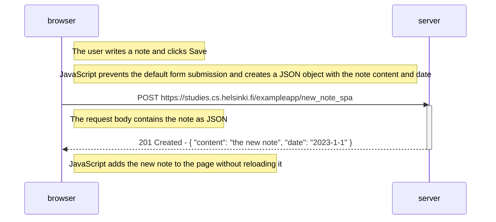

# Nueva nota en la aplicacion de una sola pagina

```mermaid
sequenceDiagram
    participant browser
    participant server

    Note right of browser: The user writes a note and clicks Save
    Note right of browser: JavaScript prevents the default form submission and creates a JSON object with the note content and date

    browser->>server: POST https://studies.cs.helsinki.fi/exampleapp/new_note_spa
    activate server
    Note right of browser: The request body contains the note as JSON
    server-->>browser: 201 Created - { "content": "the new note", "date": "2023-1-1" }
    deactivate server

    Note right of browser: JavaScript adds the new note to the page without reloading it
```
